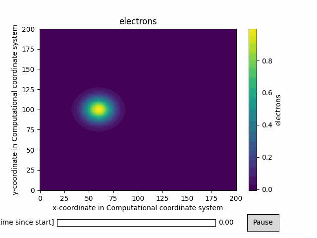
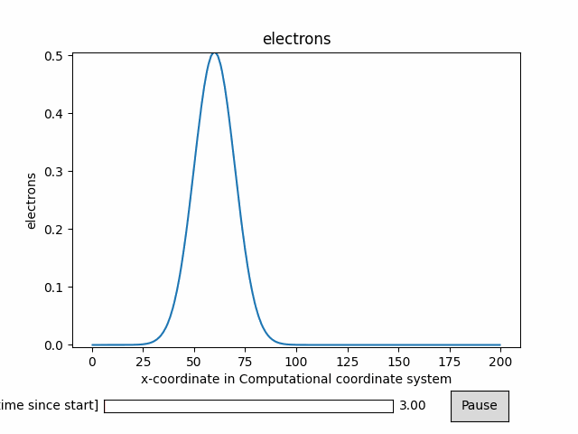

[](https://sourcery.ai)
# xFELTOR
xFELTOR provides an interface for collecting the output data from a
[FELTOR](https://github.com/feltor-dev/feltor) simulation into an
[xarray](https://xarray.pydata.org/en/stable/index.html)
dataset and extends xarray DataSet and DataArray classes with FELTOR specific plotting routines based on the [animatplot](https://animatplot.readthedocs.io/en/stable/).

xFELTOR is inspired by [xBOUT](https://github.com/boutproject/xBOUT) and uses currently some of its plotting functionality.

## Why [xarray](https://xarray.pydata.org/en/stable/index.html)?

[xarray](https://xarray.pydata.org/en/stable/index.html) is a powerful open-source python library which aims to provide Pandas-like labelling, visualization & analysis functionality for N-dimensional data. Some of the basic features are:
* **Labelled multidimensional data**: xarray wraps numpy arrays with their `dims` as `DataArray`s.
* **Clear syntax for operations**: xarray provides clearer and more general syntax containing less magic numbers than numpy 
* **Lazy loading into memory**: never wastes RAM on unneeded values
* **Plotting convenience**: xarray provides plotting functions (wrapping matplotlib) which automatically use an appropriate type of plot for the dimension of the data (1D, 2D etc.)

For more information see the xarray [getting started guide](http://xarray.pydata.org/en/stable/getting-started-guide/why-xarray.html). Tom Nicholas' [presentation](https://github.com/TomNicholas/xBOUT--BOUT-workshop2019) about xarray and xBOUT is also a good place to start. 
## Installation

Dev install:
```
git clone https://github.com/uit-cosmo/xFELTOR.git
cd xFELTOR
pip install -e .
```


### Loading your data

The function `open_feltordataset()` uses xarray & dask to collect FELTOR
data into one xarray dataset. This can be either a single output file or multiple coherent files for restarted simulations.

The data can be loaded with

```python
ds = open_feltordataset("./run_dir*/*.nc")
```
xFELTOR stores all variables from the FELTOR input file as attributes (xarray.Dataset.attrs).
### Plotting Methods

In addition to the extensive functionalities provided by xarray, xFELTOR offers some useful plotting methods. 

In order to plot the evolution of a 2D variable over time:
```python
ds["electrons"].feltor.animate2D(x="x", y="y")
```
 

For plotting a 1D variable over time:
```python
ds["electrons"].isel(y=100).feltor.animate1D(animate_over="time")
```
 

You can also plot multiple 1d and 2d variables over time:
```python
ds.feltor.animate_list(
    variables=[
        ds["electrons"],
        ds["ions"].isel(y=100),
        ds["potential"],
        ds["vorticity"],
    ]
)
```
